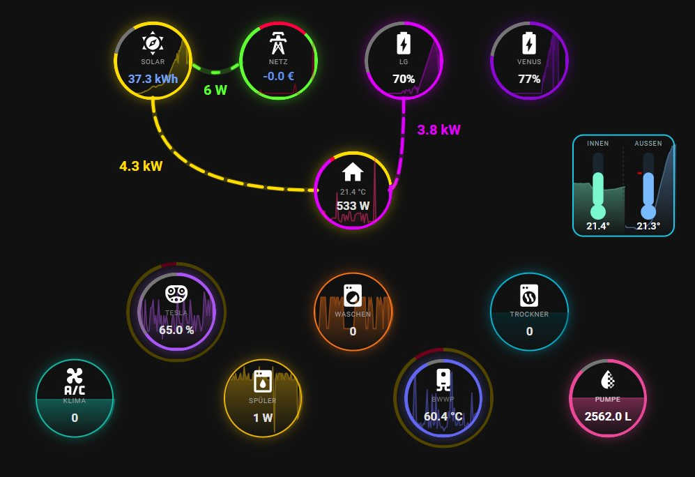
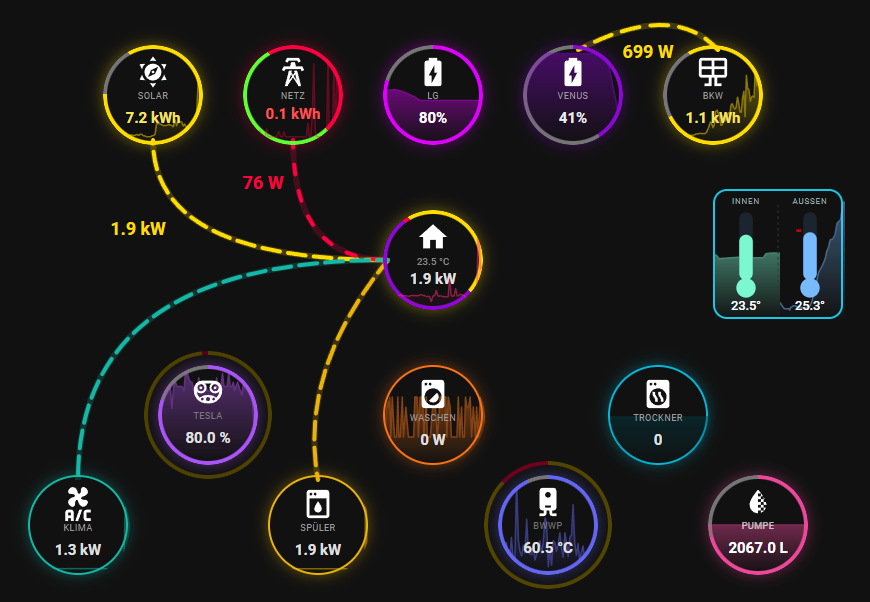
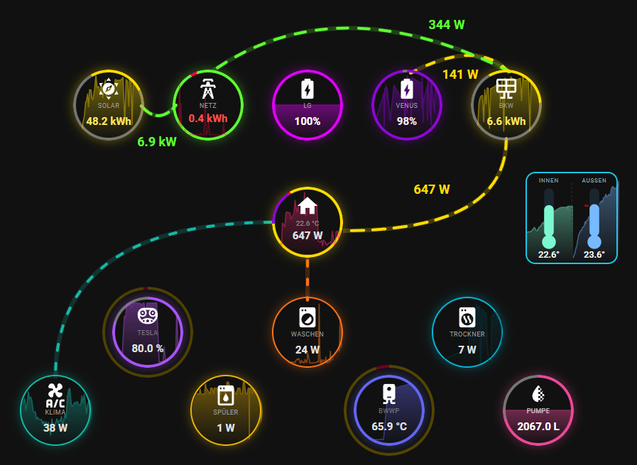
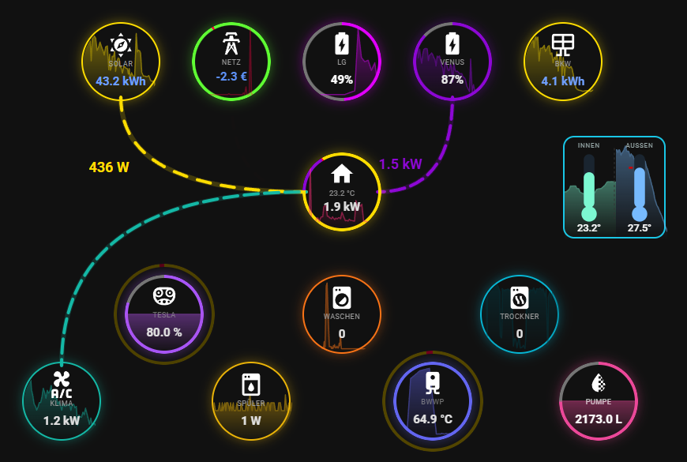
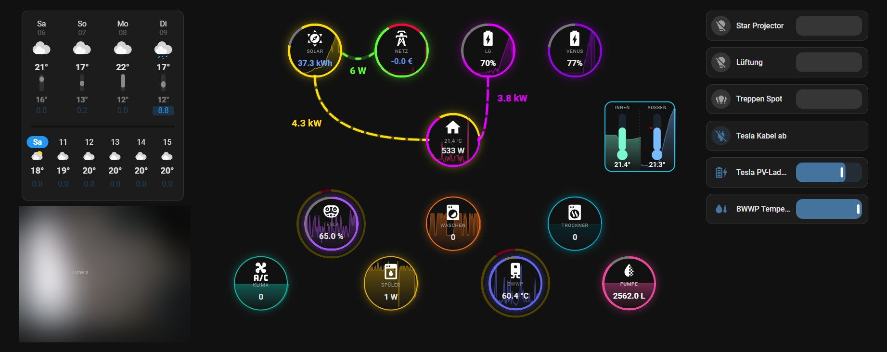

# HEIMDALL Flux Card

[](https://hacs.xyz/docs/faq/custom_repositories/)
[](https://github.com/JochenRi/heimdall-flux-card/releases)
[](LICENSE)
[](https://github.com/JochenRi/heimdall-flux-card/commits/main)
[](https://www.paypal.me/quadFlyerFW)
[](https://paypal.me/JohannesRichter06)

An animated power-flow card for Home Assistant, adapted for **dual-battery energy systems** with many tracked consumers.

<p align="center">
  
</p>

> ⚠️ **This is a personal fork of [Power Flux Card](https://github.com/jayjojayson/power-flux-card) by [@jayjojayson](https://github.com/jayjojayson) (MIT License).**
>
> If you need a **universal, single-battery solution**, please use the original card. It is mature, actively maintained, and covers all standard energy-flow setups.
>
> ⭐ **Please star the original**: https://github.com/jayjojayson/power-flux-card
> ☕ **Support the original author**: https://www.paypal.me/quadFlyerFW

---

## Features

- **Four sources** in the top row: Solar, Grid, and two independent batteries (LG + Venus), each with its own state of charge and signed power.
- **Up to seven consumer bubbles** (e.g. EV, washing machine, dryer, dishwasher, heat pump, climate, pump), each individually enabled and configured.
- **House bubble with a 4-segment donut** (PV / Battery 1 / Battery 2 / Grid), in a live mode and a daily-mix (kWh) mode.
- **Per-bubble rings and overlays**, configured independently for every bubble:
  - an inner **donut** with a configurable maximum (state of charge %, temperature °C, water level, …),
  - an outer **charge-mix ring** showing the energy-source split (PV / LG / Venus / Grid) over a day, month, or year, with configurable segment colors,
  - a **value rotation** between up to three daily sensors,
  - an inline **sparkline** history.
- **A fifth source bubble for a balcony plant / behind-the-meter PV** whose panels feed a battery's DC inputs directly, and which therefore never appears in the main solar reading — see [Behind-the-meter PV](#behind-the-meter-pv-bkw).
- **Separate Solar→Battery 1 and Solar→Battery 2 pipes**, routed as two distinct paths that never overlap.
- **Signed-power logic per battery** (positive = charging, negative = discharging) with a sign-mode selector.
- **Animated backgrounds** (Aurora, Slow Flow), respecting `prefers-reduced-motion`.
- **Optional side panels** (left and right) that collapse into a single stacked column on narrow / mobile screens.
- **Full visual editor** with collapsible sections for every bubble.
- **Bilingual**: German / English.

---

## What this card is for

This card visualizes the **current power distribution** of a home with **two independent batteries** and many large consumers — built for the [HEIMDALL home energy management system](https://github.com/JochenRi/heimdall-flux-card) (LG RESU + Marstek Venus).

It is **not** a replacement for the original Power Flux Card. If you have a single battery, or want a universal solution, use [the original](https://github.com/jayjojayson/power-flux-card) — it is the better choice and the foundation this card is built on.

---

## Installation

### HACS (custom repository)

[](https://my.home-assistant.io/redirect/hacs_repository/?owner=JochenRi&repository=heimdall-flux-card&category=dashboard)

This card is distributed as a **HACS custom repository**.

1. Open **HACS** in Home Assistant.
2. Open the three-dot menu (top right) → **Custom repositories**.
3. Add `https://github.com/JochenRi/heimdall-flux-card` with category **Dashboard**.
4. Search for **HEIMDALL Flux Card** and click **Download**.
5. Reload your browser. HACS registers the resource automatically at
   `/hacsfiles/heimdall-flux-card/power-flux-card.js` (type: `module`).

<details>
<summary>Manual installation</summary>

1. Download `power-flux-card.js` from the [latest release](https://github.com/JochenRi/heimdall-flux-card/releases/latest).
2. Copy it to `config/www/heimdall-flux-card/power-flux-card.js`.
3. Add it as a dashboard resource (Settings → Dashboards → ⋮ → Resources → Add):
   - URL: `/local/heimdall-flux-card/power-flux-card.js`
   - Type: `JavaScript Module`

</details>

---

## Configuration

The card is **fully configurable through the visual editor** — add it to a dashboard, click **Edit**, and every bubble exposes its own collapsible section for sensors, colors, thresholds, donut, charge-mix ring, rotation, and sparkline. The tables below cover the YAML keys for reference; you rarely need to edit YAML by hand.

> The card element name is kept as `power-flux-card` (not `heimdall-flux-card`) for backward compatibility.

### Card options

| Name | Type | Default | Description |
| --- | --- | --- | --- |
| `type` | string | **required** | `custom:power-flux-card` |
| `entities` | object | **required** | Sensor entities — see [Entities](#entities) |
| `zoom` | number | `0.9` | Overall scale factor of the card |
| `bubble_size` | number | `90` | Diameter of each bubble, in px |
| `card_offset_x` / `card_offset_y` | number | `0` | Pixel offset of the whole flow inside the card |
| `transparent_background` | boolean | `false` | Remove the card background |
| `bg_anim_style` | string | `off` | Animated background: `aurora`, `flow`, or `off` |
| `show_neon_glow` | boolean | `true` | Neon glow around bubbles and pipes |
| `hide_inactive_flows` | boolean | `true` | Hide pipes whose value is below threshold |
| `show_consumer_always` | boolean | `false` | Show consumer bubbles even at 0 W |
| `hide_consumer_icons` | boolean | `false` | Hide the small consumer-icon row |
| `battery_enabled` | boolean | `true` | Show the first battery (LG) bubble |
| `venus_enabled` | boolean | `true` | Show the second battery (Venus) bubble |
| `consumer_6_enabled` / `consumer_7_enabled` | boolean | `false` | Enable the 6th / 7th consumer bubble |
| `side_panels_enabled` | boolean | `false` | Show optional left/right side panels |
| `side_panel_width` | number | – | Width of each side panel, in px |
| `side_panel_gap` | number | – | Gap between panels and the card, in px |
| `left_panel_cards` / `right_panel_cards` | array | – | Lovelace cards to render inside the side panels |

### Entities

All sensors are assigned in the editor; none are hard-coded.

| Key | Description |
| --- | --- |
| `solar` | Current PV power |
| `grid_combined` | Combined grid power (negative = export, positive = import) |
| `grid` / `grid_export` | Alternative split grid entities (import / export) |
| `battery` | Battery 1 (LG) power, signed |
| `battery_soc` | Battery 1 state of charge (%) |
| `battery_charge` / `battery_discharge` | Alternative split charge / discharge entities |
| `venus` | Battery 2 (Venus) power, signed |
| `venus_soc` | Battery 2 state of charge (%) |
| `bkw` | Balcony-plant power, DC-coupled to Battery 2 — see [Behind-the-meter PV](#behind-the-meter-pv-bkw) |
| `bkw_donut_produced_today` | Balcony plant: energy harvested today (kWh) |
| `bkw_donut_forecast_today` | Balcony plant: energy **still expected** today (kWh) — a remaining value, not a daily total |
| `house` | Total house consumption |
| `consumer_1` … `consumer_7` | Power of each consumer bubble |

Per-bubble extras — the inner **donut**, the **charge-mix ring** (with day/month/year sensors and segment colors), the **value rotation** (up to three daily sensors), and the **sparkline** — are all assigned in each bubble's section of the visual editor.

### Minimal example

```yaml
type: custom:power-flux-card
entities:
  solar: sensor.solar_power
  grid_combined: sensor.grid_power
  battery: sensor.battery_1_power
  battery_soc: sensor.battery_1_soc
  venus: sensor.battery_2_power
  venus_soc: sensor.battery_2_soc
  house: sensor.home_consumption
  consumer_1: sensor.consumer_1_power
  consumer_2: sensor.consumer_2_power
  consumer_3: sensor.consumer_3_power
battery_enabled: true
venus_enabled: true
show_neon_glow: true
```

---

## Behind-the-meter PV (BKW)

Some PV arrays never show up in the inverter reading at all. A balcony plant
wired straight into a battery's MPPT inputs sits **behind** the storage unit:
its energy reaches the house through the battery's AC output, so the meter that
watches the roof inverter never sees it. Point `entities.solar` at that meter
and the array is simply invisible — and every attempt to add it there
double-counts, because the roof reading never contained it in the first place.

The `bkw` bubble models such an array as an **independent source** that is
deliberately not subtracted from the solar figure. Its output is split three
ways, each drawn as its own pipe:

| Pipe | Meaning |
| --- | --- |
| BKW → Battery 2 | Surplus the battery absorbs |
| BKW → House | Pass-through covering actual house demand |
| BKW → Grid | What is left over, exported |

### Required setup

The battery entity **must report its AC side**, not a net figure that already
contains the array. A common trap is a template sensor along the lines of
`pv_power − battery_ac_power`: with the array's energy already netted out
there, the card cannot separate the two flows and will draw a phantom
house→battery flow that never physically existed.

```yaml
entities:
  bkw: sensor.garden_pv_power              # the array's own DC/MPPT reading
  venus: sensor.battery_2_ac_power         # AC side, NOT a net sensor
  bkw_donut_produced_today: sensor.garden_pv_energy_today
  bkw_donut_forecast_today: sensor.garden_pv_forecast_remaining
invert_venus: true                         # positive = feeding the house
bkw_donut_today_mode: true
```

### The production ring

The ring compares what has been harvested against what is **still expected
today**, so `bkw_donut_forecast_today` has to be a *remaining* value. Feeding a
daily total in there shows roughly 50 % left at dusk on a finished day. With
Forecast.Solar, use the `energy_production_today_remaining_*` entities rather
than `energy_production_today_*`.

### In practice

Morning — the battery has room, so the entire output charges it and nothing
reaches the house:

<p align="center">
  
</p>

Afternoon — the battery is nearly full, so the array covers the house demand
exactly and exports the rest, while the roof feeds the grid untouched:

<p align="center">
  
</p>

Night — no production; the battery discharges into the house on its own:

<p align="center">
  
</p>

### Known limitation

Forecast.Solar's free tier models a clear horizon. On a shaded plot the real
curve is narrower and taller than the forecast — noticeably more around midday,
less at either end of the day. Raising `modules_power` calibrates the daily
total, but it cannot correct the shape, and the evening damping factor is the
wrong tool for it: it thins out the whole second half of the day, including the
hours that are already underestimated.

---

## Screenshots

The card in its full three-column layout, with optional side panels for weather, a camera, and entity tiles. On narrow screens the side panels collapse into a single stacked column for mobile use.

<p align="center">
  
</p>

---

## Support

This card is built entirely on the original Power Flux Card. **If you find it useful, please support the original author first** — the upstream project is the foundation for everything here:

- ⭐ Star [Power Flux Card](https://github.com/jayjojayson/power-flux-card)
- ☕ Support **@jayjojayson** (original author): https://www.paypal.me/quadFlyerFW

If you would *additionally* like to support the ongoing upkeep of **this dual-battery fork**, that is very welcome — but entirely optional, and never instead of the original:

- ☕ Support this fork's upkeep: https://paypal.me/JohannesRichter06

---

## 🙏 Credits & Acknowledgements

This card is based on **[Power Flux Card](https://github.com/jayjojayson/power-flux-card)** (MIT License) — Copyright © [jayjojayson](https://github.com/jayjojayson).

The upstream project provides the **entire foundation** of this card:

- The complete card architecture (lit-html, ES modules, visual editor)
- The SVG layout system, bubble framework, and pipe animation engine
- The visual editor with its options and translations
- The neon-glow, comet-tail, donut-chart, and tinted-background effects
- The German / English localization framework

➡️ **Please star the original**: https://github.com/jayjojayson/power-flux-card
➡️ **Support the original author**: https://www.paypal.me/quadFlyerFW

The original README, unmodified, is preserved at [`docs/UPSTREAM-README.md`](docs/UPSTREAM-README.md) for reference.

### Modifications in this fork

All modifications by **Johannes ([@JochenRi](https://github.com/JochenRi))** for the HEIMDALL home energy management system:

- Top row extended from 3 to 4 bubbles (second independent battery added)
- New pipe paths: Solar→Battery 1 and Solar→Battery 2 routed as separate geometric paths
- Per-battery signed-power logic with a sign-mode selector
- House donut extended from 3 to 4 segments (PV / Battery 1 / Battery 2 / Grid), with a daily-mix mode
- Up to seven configurable consumer bubbles, each with its own donut, charge-mix ring, value rotation, and sparkline
- Animated card backgrounds (Aurora, Slow Flow)
- Optional side panels that collapse to a stacked single column on narrow screens
- Visual editor reorganized into collapsible per-bubble sections

---

## 📄 License

MIT License — see [LICENSE](LICENSE).

This project preserves all copyright notices from the upstream project. The MIT license terms apply to both the upstream code and the modifications.
